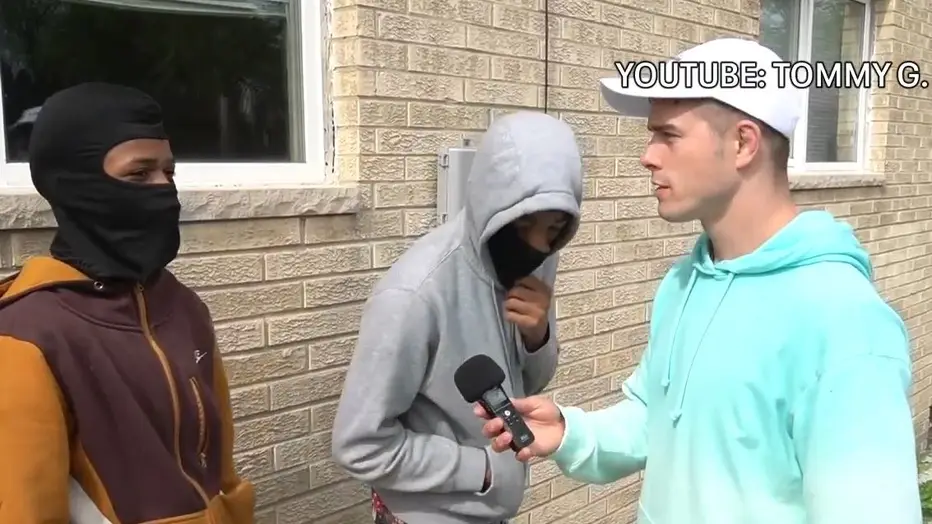
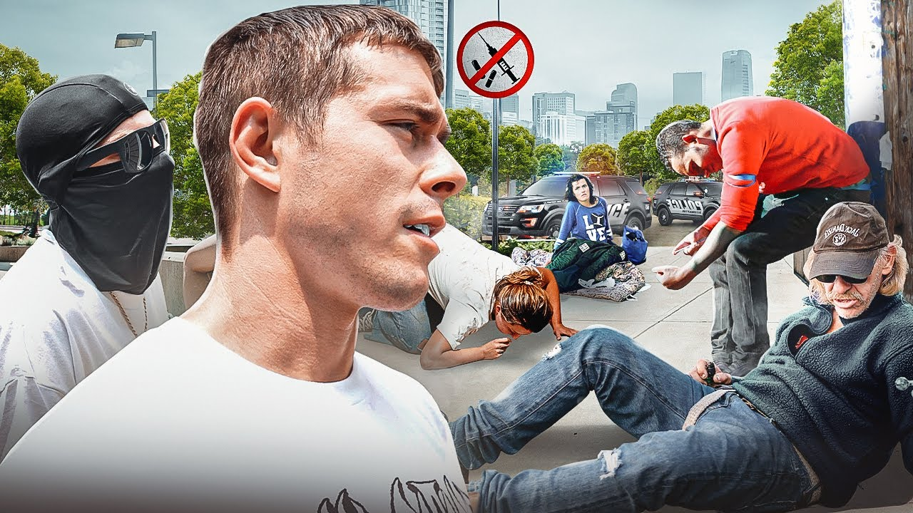

# Tommy G Mcgee

_[Tommy G](https://www.youtube.com/@TommyGMcGee) is a popular youtuber that travels around the United states and 
reports on real stories effecting different cities. He has 1 million
subsribers and posts weekly documentarys. Tommy G is a independant
journalist and has no media affiliations._

**Tommy G interviews normal people to understand the unreported stories. You can see in the immage above that he is interviewing 2 individuals that are a part of a gang.**

## Tommy G's most popular video
Tommy G only got popular about 1 year ago. He released a video called [Kia Boys Documentary](https://www.youtube.com/watch?v=fbTrLyqL_nw&ab_channel=TommyG).This video was released 1 year ago and got over 7 million views and over 150k likes. This video was well recieved by the public as Tommy G provided a strong narative about this pressing problem.Furthermore, we have seen a continuation of this problem as car theft is at a all time high specifically in Seattle.

## Tommy G's focus on the drug epidemic
A lot of states and cities have been struggling to combat the durg problem. Tommy G has documented many stories around across the country surrounding drugs, gang violence, and poverty.
Tommy G's focus on showing people the real effects of the drug epidemic and even how covid-19 has destroyed many cities. Tommy G's independant journalism has continued to grow as we see the decline of mainstream news media.
Tommy G does not push his political views he only shows the truth surrounding different problems in hopes changes can be made.

## The furture of Tommy G and independant journalism
Tommy G has stayed in the United States and documented many stories through many states. He just announced he will be traveling to afganastan to document stories there. This is the start of Tommy G taking his journalism abroad in order to cover stories world wide. Other youtubers and community members have also been focusing more on independant journalism. The trust in the traditional news is at a all time low and if people want changes they need to follow Tommy G's lead.

## See also
- [Internet famous scamer](https://www.youtube.com/watch?v=y4BwEdAwgVQ)
- [Visiting the most dangerous town in America](https://www.youtube.com/watch?v=dGf5cSRsyXo)
- [Visiting Kensington](https://www.youtube.com/watch?v=IyBkJES4QyU)

## References
1. https://www.youtube.com/@TommyGMcGee/videos
2. https://www.google.com/url?sa=i&url=https%3A%2F%2Fwww.fox6now.com%2Fnews%2Fkia-boys-youtube-documentary-milwaukee-police-call-it-disturbing&psig=AOvVaw3EOsa_gHl-JVKUYkEe-4lq&ust=1696632613117000&source=images&cd=vfe&opi=89978449&ved=0CBAQjRxqFwoTCNj50Z3_34EDFQAAAAAdAAAAABAD
3. https://www.google.com/url?sa=i&url=https%3A%2F%2Fwww.youtube.com%2Fwatch%3Fv%3DnD208QB8kSk&psig=AOvVaw0pZiR_w_KXmYPjj1ZeUi7i&ust=1696633955389000&source=images&cd=vfe&opi=89978449&ved=0CBAQjRxqFwoTCLDAiJeE4IEDFQAAAAAdAAAAABAD